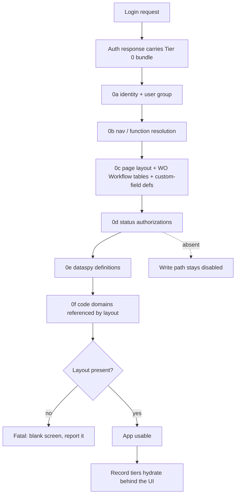
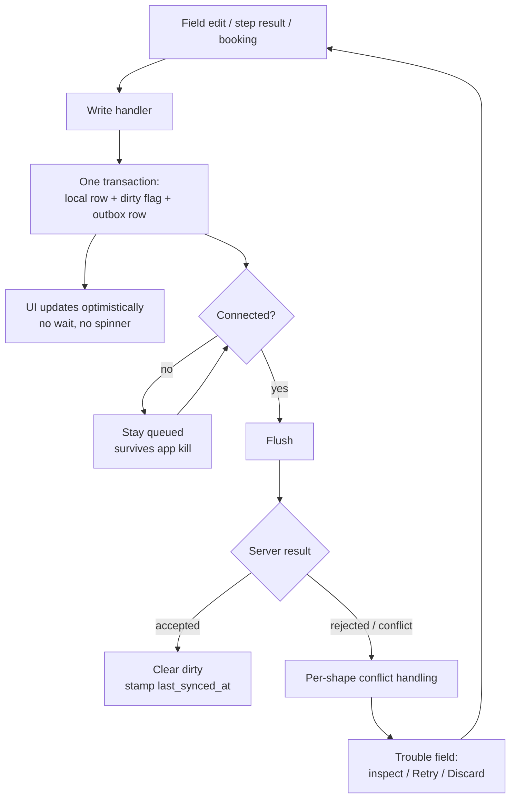
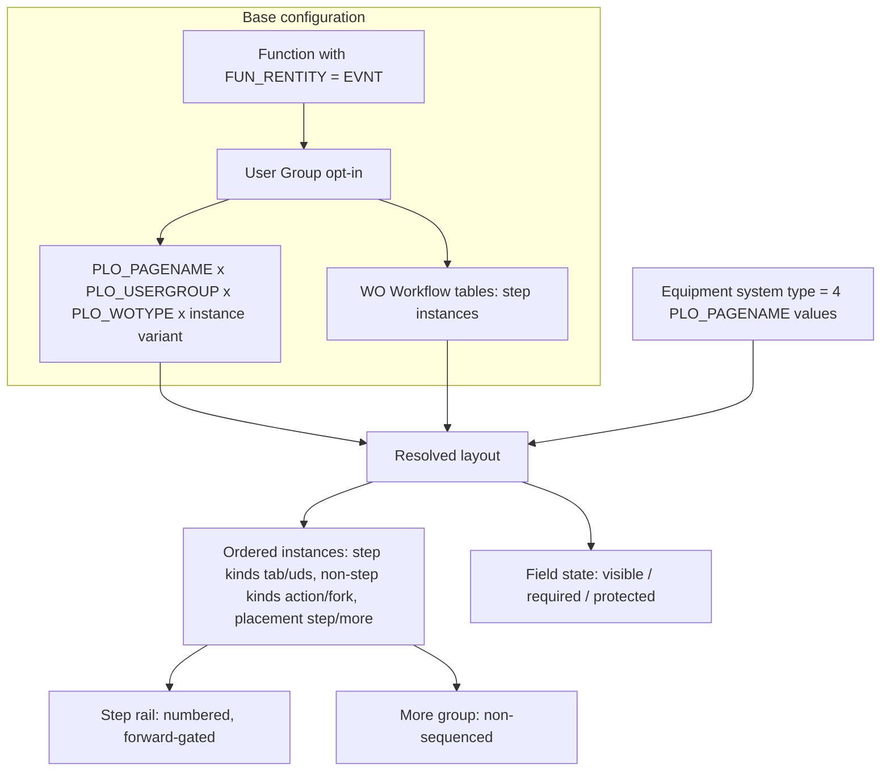

# Continuum — HxGN EAM Mobile v1

*One app, one online/offline continuum, one guided workflow.*
"Continuum" is a working codename so the project can be named in a sentence; drop
it if the programme already has one.

---

## Metadata

| | |
| --- | --- |
| **Author** | Daniel Kilburn (TPM) |
| **Created** | 2026-09-11 |
| **Status** | **Draft — for squad review.** Nothing here is approved. |
| **Authoritative URL** | `dannykayburn/eam-mobile` → `docs/EAM-Mobile-Design-Doc-v1.md` (master). Any copy pasted into a deck, wiki or email is a snapshot, not the doc. |
| **Format** | Per *Refactoring English*, "Write an Effective Design Doc." Sections are sized to risk, not to the template — several are deliberately short pointers. |

### Sign-offs

Approval means "I have read the sections I own and I will build/design/schedule
against them." It does not mean the open issues are closed.

| Role | Owns (must review) | Name | Date |
| --- | --- | --- | --- |
| **Product Management** | Objective, Background, Goals, Non-goals, Scenarios | *unassigned* | |
| **UX** | Scenarios, Interfaces, Glossary | *unassigned* | |
| **Dev lead (mobile)** | Diagrams, Constraints, SLOs, Monitoring, Dependencies, Security, Privacy, Logging | *unassigned* | |
| **Dev lead (base EAM)** | Interfaces (server), Dependencies, Open issues 0–4 | *unassigned* | |
| **TPM** | Timeline, Open issues, Resolved issues, this table | D. Kilburn | 2026-09-11 |
| **Security / Legal** | Security, Privacy, Legal | *unassigned* | |

### What this doc owns, and what it does not

This doc is the **summary layer**. A squad member should be able to read it end
to end and start work without opening anything else.

**It owns outright** — nothing else holds these: the **objective**, the
**requirements R1–R6** and the requirement-level rules behind them, the
**goals and non-goals**, the **scenarios**, the **screen map**, the **SLOs**,
**monitoring**, **security**, **privacy**, **legal**, **logging**, the
**timeline**, and the **sign-off record**.

**It does not own a single design rule.** Every locked rule lives in
`design-decisions-v3-1.md` at the `§` given. This doc points; it never restates
rationale. That spec is long and organised by topic — **grep for the section you
need rather than reading it end to end.**

> **The one rule that keeps this doc honest:** if a paragraph here duplicates a
> `§` instead of pointing at it, delete the paragraph and leave the pointer. A
> "summary of X" that restates X drifts — that already happened once in this
> repo, over about a month, and the offending doc was retired for it.

## Objective

Replace HxGN EAM's two mobile apps with **one native, technician-first work-order
execution app** in which online and offline are a single continuum the technician
never has to think about, and in which no completed work is ever lost.

---

## Background

**The customer problem, in the customer's words.** SWG advisory feedback converges
on four themes, all of them High:

1. **Two separate mobile apps** — Digital Work and EAM Offline behave differently,
   navigate differently, and confuse configuration, capability and licensing.
   Checklists, documents and activity timers all differ between them.
2. **Offline sync reliability** — work is lost if connectivity drops during save;
   there is no queue, and the technician cannot tell whether a transaction landed.
3. **Training dependency** — record-centric workflows demand tribal knowledge an
   aging, less-technical workforce does not have.
4. **Hybrid connectivity** — customers want one continuum, not a mode choice and
   not an app choice.
**The prior attempt, and why it failed.** The existing fully-offline app downloads
so much data that it causes performance problems and crashes. That single fact is
why v1 is online-first rather than offline-first, and it is the test any
offline-scope proposal has to pass.

**Where the project actually is.** A UX/UI design phase has produced **15 navigable
mobile prototype screens plus the Workflow Designer Portal**, all on one shared
component system, with decisions locked and rationale recorded in a 10,000-line
spec. *(Three separate base-EAM admin prototypes preceded the portal; all three
were retired into it on 2026-09-16.)* Two standards-reference files act as the build contract. What does *not*
exist: a data layer, an API contract, tests, an accessibility pass, i18n, or any
device-verified visual review beyond the Activity Checklist.

**Why this doc exists now.** The design record is large, dense and organised by
topic. A squad cannot start from it. Two architecture questions that used to block
everything were closed on 2026-09-08 (the offline read model, and GIS scope), so
the remaining unknowns are small enough to enumerate — which is the precondition
for a design doc rather than another spec section.

---

---

## Related documents

The doc set was cut back on 2026-09-11 to keep the reading surface small: four
maintained documents plus `CLAUDE.md`, and two reference folders that are
consulted rather than read.

| Document | What it owns | Read it when |
| --- | --- | --- |
| `docs/design-decisions-v3-1.md` | **Every locked design rule, and its rationale.** §1–§31. Open items §20, superseded decisions §21. | "What is the rule for X?" **Grep for the section.** |
| `docs/component-library.md` | What a UI pattern is **called**, and its rules. | Before naming or inventing a component. |
| `docs/ui-component-inventory.md` | Raw CSS-level component audit. | Porting a component. |
| `docs/handoffs/EAM-HANDOFF-UX-User-Testing-Brief.md` §4 | Catalogue of known prototype stubs. | Before device testing — do not rediscover the list. |
| `docs/existing_use_cases/` | Requirement docs inherited from DUX: Login, Settings, Sync Config, Transaction Log. | Designing any of those four. |
| `CLAUDE.md` | Which screen lives in which file, and the implementation traps. The live prototype inventory. | Touching the prototypes. |

**Owed, and does not exist yet:** a test plan, an API contract / field-mapping
artifact, and the per-entity offline policy registry. All three are in Open
issues.

---

## Requirements

**This section is the single home for R1–R6.** Absorbed 2026-09-11 from the
requirements one-pager, which is no longer maintained. What follows is
requirement-level only — the things that would still be true if every screen were
redrawn. Per-screen and per-field decisions live in the spec at the `§` given.

Sources: SWG Voice-of-the-Customer themes, the connected-worker roadmap MVPs, the
user-given requirements **R1–R6** (2026-09-03), and the eight locked design
paradigms.

### R1–R6, as testable statements

Stated so each can be *checked* rather than agreed with in principle.

| # | Requirement | Testable form | Status |
| --- | --- | --- | --- |
| **R1** | Online-first, with offline capability for transactions of **only specific entities** | The set of entities that accept an offline write is **declared and enumerable**, and is a small subset of what the app can read | **Locked** — spec §2.1/§2.7; ~7 write shapes |
| **R2** | Handle GIS maps (ArcGIS and others — OSM etc.) | The app renders EAM records against a basemap and supports what the existing product already supports, offline included | **Phase 2** — spec §28; see NG1 |
| **R3** | Configurable page layout | Answered by Tier 0 `0c`. Extension owed: a map must be *placeable* by Screen Designer | Layout **locked**; map placement Phase 2 |
| **R4** | Honours existing dataspy/grid paradigms for searching and returning records | A dataspy returns the same rows on mobile as on desktop, **or the app says why not** | **Locked, and improved** — dataspies run server-side at full fidelity (spec §6.13) |
| **R5** | Downloads are non-modal; the user can manually bring a record offline ("cache this so I can keep working") | No blocking modal; a per-record "keep offline" action exists; progress is visible in an **existing** surface | Specified, **unbuilt** — 3 small UI pieces owed (spec §20) |
| **R6** | Handle sync error discrepancies easily from the device | Every failed write is inspectable and actionable on-device, and **no write is ever silently discarded** | Surface exists; **the guarantee is new** — LWW withdrawn (spec §2.5) |

### Requirement-level rules the build must honour

Conclusions only, each with its `§`. These are obligations, not design choices —
a change here is a change to what we promised, not a preference.

**Trimmed 2026-09-23, from ~50 bullets to 18.** What came out was every bullet
whose fact has a better home elsewhere in this doc — a Goal, a Non-goal, a
Constraint, a diagram caption or a Screens row. What stayed is the set of
obligations that are stated **only** here. The rule going forward: if a rule you
want to add is already a G, an NG, a Constraint or a diagram caption, add it
there and leave this list alone.

**Offline & connectivity**

- **Online-first reads, with the local store as a scoped fallback** — never a
  replica of the whole database. *(R1; spec §2.1.)*
- **Offline transaction capability is declared and enumerable**: ~7 write shapes
  (WO status / step state, checklist results, labor bookings, part issues, meter
  readings, comments, attachments). A per-entity conflict UI is buildable for
  seven and not for sixty — **R6 is only tractable because of this.** *(Spec
  §2.4/§2.7.)*
- **"What downloads" and "what still works" are different axes with different
  owners.** Entity policy is **customer-configured scope**; every
  work-execution action carries one of five capability states, which are a
  **product-declared architectural fact**, versioned with the app and not
  admin-editable. *(Spec §2.7/§2.9.)*
- **Caps are limits, not guidance**, plus **reachability traversal** — a root
  pulls its children and its declared depth-1 references, references terminal by
  default. A device ceiling, a per-entity row cap, per-collection traversal caps,
  filters on indexed columns only, and an offline-incapable entity list enforced
  at authoring time. **Whether an entity needs a dataspy at all is arithmetic,
  not a blanket rule** *(revised 2026-09-18)*: an entity may ship its whole
  domain when that domain fits both the row cap and the volume budget — otherwise
  a dataspy is required and must itself fit. Both dimensions bind on real rows,
  so **a records-only rule passes every check and still overflows the device.**
  What is unconditional is that a *filtered* policy with no dataspy is refused.
  *(Spec §2.3/§2.7.)*
- **"Offline" is provisioned, not chosen.** Three layers — Tier 0 always
  persisted, the outbox always on, **record replication as the only switchable
  layer** — assigned as a named profile in the portal's User Groups area, with
  "none" as the off state. Admin-provisioned, invisible to the technician, fixed
  for the session: that is provisioning, not a mode. *(Spec §2.10.)*
- **The write path stays disabled until status authorizations are present.**
  *(Spec §2.3; see Security.)*
- **Lookups resolve three ways offline** — bounded code domains replicate whole;
  unbounded entity lookups derive from what is on the device **with the scope
  announced**; values whose selection re-resolves configuration are pickable only
  if that configuration is present. **Never a silent short list** — a short list
  looks like correct data. *(Spec §2.8; scenario S4.)*

**UI / UX**

- **No view/edit mode split.** No Edit button, no form mode. Every editable field
  is tapped in place and edits through a bottom sheet. *(Spec §5.1 / P3 — the
  core interaction decision, and the biggest departure from both legacy apps.)*
- **No required-field markers outside Insert Mode**, because required fields
  simply cannot be cleared. *(Spec §9.8/§23.)*
- **The app never blocks on bulk record download, and never gates itself on
  connectivity state** — clarified 2026-09-11, because "no blocking modals
  anywhere" was being over-read. A **discrete, user-initiated server round-trip
  may block** for as long as it takes: initial login including the Tier 0 fetch,
  a server search, opening a record not held on the device, first-run
  configuration. What stays banned: a launch-time hydration modal, a modal
  triggered by connectivity rather than by the user, a modal over a write (writes
  return from the outbox immediately), and a modal over manual caching. *(Spec
  §2.3; P1/P8.)*
- **Colour is a closed instrument set**, not a palette. *(Spec §23.)*
- **Being offline never changes field behaviour.** Nothing becomes Protected
  because the device lost signal — field state resolves from page layout, which
  is identical online and offline. What may narrow is an *action*, and only when
  the server's answer cannot be deferred. *(Spec §2.9, researched against six
  comparable products; scenario S3.)*

**Workflow & base configuration**

- **Function resolution is per user group**, never one blessed function — any
  function with `FUN_RENTITY = EVNT` may be workflow-enabled, opted in per group.
  So the same function can present as a five-step gated flow to one group and a
  looser three-step one to another, with no code difference. **Still locked**, and
  it holds whichever way Open issue 1 goes. *(Spec §26.2/§26.7.)*
- **Which function the app resolves is an OPEN DECISION** — reuse
  `WSJOBS`/its clones, or a new standalone mobile function. Required before the
  base track starts. *(Open issue 1; spec §11.)*
- **WO resolves on `PLO_PAGENAME × PLO_USERGROUP × PLO_WOTYPE × instance
  variant`** — a new `PLO_WOTYPE` column, two WO Workflow tables, and a
  page-variant dimension that is blank for instance 1 so nothing migrates.
  *(Spec §11–§13/§29.2.)*
- **Placement governs what downloads, not just what displays.** A UDS child tab
  replicates to the device **iff it is placed** in the resolved layout. *(Spec
  §27.5.)*
- **Type is protected at its commitment point, not at insert.** WO Type is
  editable while not started and **Protected from Start Work onward, no
  exceptions and no permission escape**; Equipment's system type is Protected in
  update mode, always. One paradigm, two trigger points. *(Spec §13.5/§26.8.)*
- **Configuration is versioned, and a WO in flight finishes on the shape it
  started with** — pin the resolved config version at Start Work. *(Proposal, not
  locked; Open issue 5.)*
- **UDS authoring is three-way and stays split:** base UDS setup defines the
  fields, the portal's workflow canvas places the tab, and its User Groups area
  assigns it. *(Spec §27.)*

### The problem statement behind all of it

**In the user's words:** the current fully-offline app downloads so much that it
causes performance issues and crashes.

Worth keeping in view — it is the reason R1 reads the way it does, and **it is
the test any offline-scope proposal has to pass.**

---

## Goals

Impact, not implementation. Each goal is stated so it can be **checked**.

| # | Goal | How we know it's met |
| --- | --- | --- |
| **G1** | One app replaces two. | A customer running Digital Work and EAM Offline can decommission both. One install, one licence conversation, one navigation model. |
| **G2** | The technician never chooses a connectivity mode. | No mode chooser, no "go offline" button, no screen that asks. Search the shipped UI for the word "mode" and find nothing connectivity-related. *(Spec §2.1/§2.10.)* |
| **G3** | No completed work is ever lost, and the technician can always tell. | Every write lands in a persisted outbox in the same transaction that sets the dirty flag, survives app kill, and is inspectable and actionable on-device. **No write is ever silently discarded.** *(R6; spec §2.4/§2.5.)* |
| **G4** | A technician can execute a work order without knowing EAM. | The primary object is a workflow, not a record: numbered steps, forward-only gating that explains itself, a timer, one action per step. *(P4; spec §14.)* |
| **G5** | Search works the way desktop search works. | A dataspy returns the same rows on mobile as on desktop, at full fidelity — **or the app says why not**. *(R4; spec §6.13.)* |
| **G6** | A new screen is a configuration exercise, not a design project. | Which fields appear, in what order, required or not, **and which workflow steps exist** all come from base-EAM configuration, resolved per user group. *(P5/R3; spec §11–§13, §26.)* |
| **G7** | What reaches the device is declared, enumerable and capped. | Every entity carries one of four policies; caps are enforced at authoring time, not discovered on a device. An undeclared entity is simply not offline. *(R1; spec §2.7.)* |
| **G8** | The component system ports; it is not redrawn. | Production screens are ported from the canonical reference files, not rebuilt from comps. *(P6/P7; spec §5.2/§5.3.)* |

---

## Non-goals

Explicit, so the squad can say no with a citation.

| # | Not in v1 | Why, and where it went |
| --- | --- | --- |
| **NG1** | **GIS / maps.** | A real requirement (R2), held as an option, deliberately out of v1 — likely the programme's largest unpriced item. **Phase 2.** Three things already decided so they are not re-litigated: it is an **editor, not a viewer**; it is a **second sync engine** whose edits never ride the EAM outbox; its offline unit is a **per-map-area download**, not an app mode. One v1 consequence only: keep the definition-driven tab renderer generic enough for a map tab. *(Spec §28.)* |
| **NG2** | **Database-wide offline search.** | There is no on-device index of records the technician does not hold. Offline search covers the work set plus what was manually cached, **and says so**. This is the single question the offline model turns on, and it is answered. *(Spec §2.1/§6.13.)* |
| **NG3** | **Standalone User Defined Screen destinations.** | UDS-as-a-tab-on-WO is **in**. A standalone UDS needs a nav slot plus a full List Search Screen per customer screen, and is permanently `server-only`. Deferred. **UDS field authoring is out entirely** — base's own UDS setup owns it. *(Spec §27.)* |
| **NG4** | **Conditional field rules** ("if X is Y, make Z required"). | Phase 4+, deliberately deprioritised. **Do not spend design time picking a tier.** The only thing owed up front is naming the one-way doors — two qualify, both in Open issues. *(Spec §13.1–§13.4.)* |
| **NG5** | **A second workflow-authoring surface.** | The **Workflow Designer Portal** is the only one *(updated 2026-09-16 — it was Screen Designer, which now has no standalone destination and is invoked per step node from the portal)*. A separate Workflow Designer was built and retired for contradicting this. Don't rebuild it. *(Spec §10/§21/§30.9.)* |
| **NG6** | **Personas beyond the field technician.** | Supervisor, planner and storeroom personas are out of v1. The Standard Model is built so each additional entity is a field-set exercise, not a new app. |
| **NG7** | **Last-write-wins conflict resolution.** | Withdrawn 2026-09-08: it is silently lossy and directly contradicts R6. Conflicts resolve **per write shape** instead. *(Spec §2.5.)* |
| **NG8** | **The base product's desktop UI, in any form.** | **Out of scope entirely** (user direction 2026-09-16: *"It is just the Mobile App and this portal now. Total."*). A prototype existed and was retired to `old versions/` — a scope call, not a quality one. **This programme has exactly two surfaces: the mobile app, and the Workflow Designer Portal that configures it.** The consequence worth citing: any request to restyle, extend or reference "the Base/Desktop UI components" no longer has a destination, and the base track's whole scope is now the portal. *(Spec §21.)* |

---

## Scenarios

Written as what actually happens, not as features. These are the acceptance
narratives — if the built app cannot do these, it is not done.

**S1 — Monday morning, in the yard, on wifi.**
Priya opens the app and logs in. Inside that one login round-trip the app fetches
bootstrap configuration — identity and user group, nav and function resolution,
page layout, status authorizations, dataspy definitions, the code domains the
layout references — in that order, because layout scopes everything after it.
There is **no separate hydration modal** — the Tier 0 fetch rides the
authentication wait she is already in, and the record tiers fill in behind the UI.
Home shows her open pinned work orders. She taps one.
*(Spec §2.3, Tier 0.)*

**S2 — A work order she found by searching.**
A supervisor mentions WO 19831 verbally. It is not on her punch list. She searches
for it; the search runs **server-side at full fidelity** and finds it. She opens it
and taps **Start Work**. Five things happen at once: status moves to Start Work
Status, **WO Type protects** (no exceptions, no permission escape), the **WO pins to
her**, **all child records hydrate**, and the resolved configuration version is
stamped. Before Start Work it was a candidate; after it, it is her committed work.
*(Spec §14.11.)*
**The device-originated pin is the load-bearing detail:** a local pin must survive
a server membership list that omits it, or the next sync evicts live work.

**S3 — Step 2, in a basement with no signal.**
She works the Activity Checklist one item at a time. Each result writes through the
**same code path** it would use online — the write lands in the persisted outbox,
the UI updates optimistically, nothing blocks. Field behaviour is identical: no
field becomes Protected because the device lost signal. One *action* narrows
visibly — an action whose server answer cannot be deferred — with a stated reason,
preferring a degraded equivalent over a disabled control over an absent one.
*(Spec §2.4/§2.9.)*

**S4 — The part she needs is on the truck, not in the bin.**
She adds an ad-hoc part on Issue Parts. The Parts lookup is unbounded, so offline
it derives from **what is already on the device, and announces that scope** — never
a silent short list, because a short list looks like correct data. Bounded code
domains (closing codes, status) are replicated whole and behave normally.
*(Spec §2.8.)*

**S5 — Reconnect, and one write is rejected.**
She surfaces on the loading dock. The outbox flushes. Four writes land; one status
transition is rejected because a planner closed the WO from the desktop. The
rejection **surfaces as a trouble field with Retry and Discard**, on-device, in the
same shared component the Sync Status Screen uses. Nothing was dropped, and she can
see exactly what happened. *(R6; spec §2.5/§4.4/§4.5.)*

**S6 — A customer wants Permit to Work to be step 3, and files a config change, not a ticket.**
An admin opens the portal's Workflows area, picks the function and user group, and inserts the
customer's **User Defined Screen** as a numbered, gated, **Required** step with a
document gate on it. No code ships. The same function still presents as a looser
three-step flow to a different user group. Because **placement governs what
downloads**, placing that tab is also what replicates its definition to the device.
*(Spec §26/§27/§29.)*

**S7 — A storeroom clerk who is never out of network.**
Their user group is assigned **no offline profile**. Tier 0 config and the outbox
still work — those two layers are never switchable — but no records replicate to
the device. They are an online-only user of the same one app, on the same screens,
writing through the same outbox, with no customer record data at rest. The sync
control shows a state that is honest about this rather than reading as an error.
*(Spec §2.10; and see Open issue 7 — that state does not exist yet.)*

**This is what profile `None` is for** — an internal online-only user group: a
storeroom or planner group that is always in network.

## Screens

**What this section is:** every surface the product has, what each one is *for*,
and the high-level requirement it has to meet. It is the map a new squad member
reads to understand the shape of the app.

**It is in two halves, and the split is the programme's own** (NG8: *"It is just
the Mobile App and this portal now. Total."*). **Section 1** is the configuration
portal the administrator uses; **Section 2** is the app the technician holds.
Two personas, two design systems, one membership table between them. Anything
that is not in one of these two halves is not in scope.

**What it is not:** implementation state. Which screen lives in which file, and
the traps in each, is `CLAUDE.md`'s job — check there before touching a
prototype. Locked per-screen rules live in the spec at the `§` given.

**State column:** `proto` = navigable prototype on the shared component system,
decisions locked · `design owed` = needs a design pass before dev · `delta` =
cheap, a variation on an existing canonical screen · `no surface` = specified but
nothing authors or renders it yet.

---

### Section 1 — the Mobile Configuration Portal

**Persona: administrator.** One web app, on the Octave / OUX design system, and
**the only base-side surface this programme has** (NG8). It is what makes the
mobile app configuration-driven instead of hardcoded. Four areas over **one
membership table** — three that author metadata, one that binds it. Cardinality
is not a per-area choice: it follows what the runtime resolves on. *(§30.)*

| Area | What it must do | State |
| --- | --- | --- |
| **Workflows** | The guided flow, authored as an artifact rather than as the residue of saving a layout. Gallery of workflow cards → a drag-and-drop single-column canvas of **step instances** (§29.2), with **Screen Designer opening as a panel alongside the selected node** — not a separate screen. Non-step nodes drop between steps: two **forks** (question, condition) and three **actions** (status update, start timer, stop timer). One workflow per **(WO Type, group)**, plus one Free Form. *(§30.1–§30.4/§30.9/§30.19/§30.21.)* | `proto` |
| **— Screen Designer, as a panel** | Places fields and containers for the selected step instance, in a real 390px emulator. Each instance **deep-copies its own layout**, which is the one way to break the whole feature while everything still renders. Authors nothing about sequencing — that is the canvas's job. *(§10–§13/§29/§30.10.)* | `proto` |
| **Home Layouts** | Three levels — layout ▸ section ▸ placement — plus the pinned Create control's contents, over a **global tile catalogue holding tile ids, never copies**. The section lives on the *layout*, never on the tile, or reuse dies. Insert Mode is a **flag** on a tile, not a kind. **Also authors the app's bottom navigation bar** (up to five slots; label, screen and icon, never colour). *(§30.16/§30.24.)* | `proto` |
| **Offline Profiles** | Authors §2.7's per-entity registry: four policies on the **capability** axis, Tier 0 and the outbox rendered first as never-switchable, and caps shown because a budget you cannot see is not a budget. Whether a dataspy is **required** is arithmetic against the caps, never a description. Dataspies are *selected* here and authored on the record list screen. **Its Work Orders row is also where the punch-list dataspy lives** — the automatic half of §2.6 — settled 2026-09-23, **and it renders on every profile including `None`**, since a work list is a membership question rather than a consequence of replication. *(§30.14/§2.7/§2.10/§2.6.)* | `proto` |
| **User Groups** *(under Security)* | The inverse view, and a **binding surface only** — assignment, never steps, gating or layout, and assign is not copy. **Create refuses here:** a user group is made in Security ▸ User Groups. Carries the consistency checks, including "a Required UDS step for a group without that tab permission is an **error**." *(§26.5.1/§30.13/§27.4.)* | `proto` |
| **Equipment system-type layout authoring** | The four Location / Asset / Position / System layouts, plus the new function that renders by type. The one authoring gap that **blocks a whole track**. *(Open issue 1b.)* | `no surface` |

**Two rules about this portal that are easy to get wrong.** There are **zero
links out of it** — a rail row is an *area*, never a link to another file, and a
test asserts it, because the dead User Group Setup link is how this erodes. And
**no summary panels anywhere** (§30.20, user direction): every validator is kept
and still called, but by the control that can violate it — a clash is refused in
the assignment popover, a missing dataspy is an error on its own select. Raise
the error where the action is; do not add a roll-up back.

> **Retired 2026-09-16, and nothing should point at them again:** standalone
> **Screen Designer** and **User Group Setup** were separate screens until the
> portal became the single base entry point. Both are in `old versions/`, and
> their `eamDesignerEntry` hand-off contract retired with them.
> *(§30.6/§30.9/§21.)*

### Section 2 — the Mobile Application

**Persona: technician, the executor of work.** Everything below is the app the
technician holds. It is a different design system from the portal by deliberate
decision — §30.8 catalogues where the two diverge, and **no component crosses the
seam unchanged**.
#### App shell — wraps everything

| Surface | What it must do | State |
| --- | --- | --- |
| **Bottom nav** | Slot-bound from base configuration, not hardcoded — which destinations appear is resolved per user group. Reachable on every screen. Authored on the **Home layout** in the portal, up to five slots. *(§4.2/§26.3/§30.24.)* | `proto` device-side; authoring built |
| **Avatar / profile menu** | Identity, org, sign-out, and the route into Profile. *(§4.3.)* | `proto` |
| **Sync control** | Always visible, always honest: 4 states (Synced / Offline / Syncing / Error) as an adaptive icon-or-pill. Opens the sync panel from anywhere. *(§4.4.1.)* | `proto` |
| **Profile screen contents** | Identity plus the technician's own avatar photo. Today's nav-bar icon "adds no real value on mobile," and Equipment's photo mechanic did not generalise into it. | `design owed` |

#### Login & first run

| Surface | What it must do | State |
| --- | --- | --- |
| **Server configuration / first-run** | QR scan of org / tenant / server URL / OIDC endpoints, or manual entry, plus a connection test. Assumed at parity with the current apps and **never designed**. Inherently modal — there is no app behind it yet. | `design owed` |
| **Login** | Authenticate, and **carry the Tier 0 bootstrap bundle on the same round-trip** — this is the one place the app legitimately blocks (§2.3). Must report Tier 0 partial failure honestly: a missing layout is fatal, missing long-tail codes are degraded-but-usable. Also runs demo reset in the prototype. | `proto` is a placeholder only; real design owed |

#### Home

| Surface | What it must do | State |
| --- | --- | --- |
| **Home** | A personalized landing surface, not a settings screen — a first-class roadmap MVP. Layout *mechanics* are locked (scroll-collapse, tap-to-top, horizontal sections); **tile and chip content is a deliberately unlocked design riff** — do not build to today's tiles. Tiles route into a list screen's Search, never a bespoke list. The one named exception to the monochrome palette. *(§9.4/§23.)* | `proto` |
| **Create entity menu** | Home's `+` opens an entity choice, then shared Insert Mode locked to it. Covers WO and Equipment; the legacy system actions (Meter Reading, Work Request, Operator Checklist) are candidates, each needing a call on full Insert Mode vs. a lighter action sheet. *(§9.4.1.)* | `proto` (WO/Equipment only) |
| **Home quick-action admin** | Whichever set Home exposes has to be admin-configurable rather than hardcoded. No such base screen is located or named. | `no surface` |

#### Search — a cross-cutting standard, not a screen

Search is the surface most affected by the online-first decision, so it gets its
own entry rather than being folded into each list.

| Requirement | Detail |
| --- | --- |
| **One standard, reused** | Dataspy bar with favourites, filter chips, sort, and a dedicated Search screen. Defined once (§8.3) and copied, never redesigned per entity. WO List is the reference implementation; Equipment List is a copy of it. |
| **Dataspies run server-side at full fidelity** | All fields, all joins, all predicates, identical to desktop. This is what makes **R4 an improvement rather than a compromise**, and it is the primary read path now. *(§6.13.)* |
| **A server search may block** | It is a discrete, user-initiated round-trip — permitted to show a waiting state, bounded by SLO-3. Clarified 2026-09-11; it is not a violation of "no blocking modals." *(§2.3.)* |
| **Database-wide search does not work offline** | Offline search covers the work set plus what was manually cached, **and says so**. Never a silent short list — a short list looks like correct data. *(§2.1/§6.13; NG2.)* |
| **Tolerate how people type** | Partial values and keywords across several fields, not exact syntax or formatting. *(VoC "Search flexibility", High.)* |
| **Sort is missing on each Search sub-screen** | Markup gap only — the shared sort sheet already re-renders both. | 

#### Work Orders

The guided flow is the product. Steps are **instances** resolved from
configuration (§29), so the numbering below is the default shape, not a fixed
set. The `Instance` dimension is what makes the flow authorable at all: it is
what lets one screen be placed more than once with its own layout each time,
and what gives a **non-step node** — an action or a fork — an identity of its
own, so a status update or a timer can also be placed more than once.

| Surface | What it must do | State |
| --- | --- | --- |
| **WO List / WO Search** | The template for every top-level record list. Dataspy bar, Detailed/List modes, 6 filter chips + sort, merges locally created records and MEC child WOs. Routes each row to the right workflow by WO Type. *(§6/§8.3.)* | `proto` |
| **Step 1 — WO Record View** | The record, under a layout resolved from `PLO_PAGENAME × PLO_USERGROUP × PLO_WOTYPE × instance variant`. Header fields grid, activity selector, equipment lookup + photo, custom fields, inline Comments/Documents excerpts, conditional Route/MEC pill. **Start Work lives here** — the commitment boundary (§14.11). *(§15.)* | `proto` |
| **Step 2 — Activity Checklist** | One item at a time ("focused stepper"). 17 item types, dynamic follow-on items, per-item notes/comments/documents. **Equipment-scoped items fan out per equipment** — a 156-equipment Route produces ~624 items, and that scale is deliberate. The description *is* the instruction; there is no separate instructions field. *(§16.)* | `proto` |
| **Step 3 — Issue Parts** | Planned lines plus ad-hoc add, store/bin/lot picking, quick-issue-all. Row-scoped buttons are Action Rows. *(§17.)* | `proto`; still on hardcoded parts data |
| **Step 4 — Book Labor** | Employee, crew, trade, hours. Booking a crew expands to one row per current member. Owns the Time Only field type. *(§18.)* | `proto` |
| **Step 5 — WO Closing** | Status change, closing codes with sequential unlock, downtime, attachments. Closing returns to the Record View, not the list. *(§19.)* | `proto` |
| **Child tab — Equipment** | The first real child-tab screen and the template for the next. Backed by one shared store that is also the truth for the Record View's Route/MEC pill. Mints real MEC child work orders. *(§16.10.)* | `proto` |
| **Child tab — Comments & Documents** | One screen carrying both tabs, reached from the Record View's `View more`. Top 3 inline on the record, newest first, for every record type with these sections. *(§7.2.)* | `proto` |
| **Child tab — a UDS** | A customer-authored screen placed as a WO tab. Enters the candidate set by construction, and **can be a numbered, gated, Required step**. Needs **one generic definition-driven renderer**, never a screen per UDS. *(§27.)* | `no surface` |
| **Activity Screen** | Timer, task-plan reference, assignment status. Could double as the closing surface for Activity-driven WO Types. | `design owed` |

#### Equipment

| Surface | What it must do | State |
| --- | --- | --- |
| **Equipment List** | A copy of the WO List standard — dataspy bar, favourites, 6 chips + sort, its own Create. *(§8.3.)* | `proto` |
| **Equipment Record View** | **The canonical full record view** — copy its header/section pattern for any new record view. Carries the 74px photo slot that collapses with status on scroll. **Must re-render under a different layout by system type** (Location / Asset / Position / System) without navigating: tap an asset, then a position, and the layout changes. System type is **Protected in update mode, always**. *(§5.3/§7.5/§26.8.)* | `proto`, but against **one hardcoded layout** — see below |
| **The four system-type layouts** | Base already models these as four `PLO_PAGENAME` values, so no new column and no new table. But **the function and the authoring surface are both missing**, and that **blocks the Equipment track**: build the record view against one layout and all eight child tabs inherit the assumption. *(Open issue 1b.)* | `no surface` |
| **Child tabs (8)** | Each is its own endeavour, priced individually. Priority order: **Events, Structure Details, Parts Associated**, then the rest. No hidden design dependency — Events and Parts Associated bind to the shared List/Detail container; Structure Details binds to the shared **Structure Tree**, which needs its mount, data source and row action parameterized out of the Equipment LOV plus an additive per-node status dot. | `delta` |

#### Notifications

| Surface | What it must do | State |
| --- | --- | --- |
| **Notifications inbox** | A first-class surface, not a settings screen — a roadmap MVP. Grouped Today/Earlier, All/Unread filter, mark-all-read, per-card dismiss, tap through to the source record. Modeled on the real `R5MAILEVENTS` table. *(§25.)* | `proto` |
| **Read/unread state** | **`R5MAILEVENTS` has no read/unread column**, and the All/Unread filter depends on one. Base change or a filter redesign. *(Open issue 10.)* | blocked |
| **`comment_mention` type** | A forward reference — **@mention tagging in Comments is not built anywhere**. | not built |

#### Sync & transaction confidence

This cluster exists because of one VoC theme: *users cannot tell whether a
transaction actually landed.*

| Surface | What it must do | State |
| --- | --- | --- |
| **Sync panel** (bottom sheet) | The nav control's destination from any screen — what is queued, what failed, what to do about it. *(§4.4.2.)* | `proto` |
| **Sync Status Screen** | The full surface: per-item outbox state, and the shared trouble-field component with Retry / Discard. Every failed write is inspectable and actionable **on the device**, and no write is ever silently discarded. *(R6; §4.5.)* | `proto` |
| **Online-only state** | The sync control has no state or copy for a user group with no offline profile. For a replicating user "Offline" means *working from the device*; for this one it means *you cannot load work*. Same icon, opposite promise. *(Open issue 7.)* | `design owed` |
| **Per-row hydration / freshness affordance** | What a WO List row can honestly claim about its freshness depends on how the real sync layer behaves — deliberately unbuilt, because designing it in isolation is guesswork. | `design owed` (needs dev input) |
| **Settings / Sync Config / Transaction Log** | Three screens in the requirement set with requirement docs inherited from DUX and **no design started**. The Transaction Log is the on-device surface that keeps R6 honest without a back-office round-trip. | `design owed` |

#### Insert Mode — one create path, not a screen

| Requirement | Detail |
| --- | --- |
| **One shared implementation** | Every `+` and Create in the app opens the same sheet — WO List, Equipment List, Home. *(§9.6/§9.7.)* |
| **Always locked to an entity before it opens** | The entity shows as a protected badge in the header. There is no "what am I creating?" state. |
| **Renders the record's own screen design** | Layout comes from configuration and varies by **Type** as well as entity — a `default` variant plus one shared `alt`, cheap differences only, never a bespoke layout per Type code. *(§9.8.)* |
| **The one documented exception to the required-marker rule** | Required markers render here and nowhere else, because a blank form has nothing to clear yet. *(§9.8/§23.)* |
| **Equipment's system type is set here or never** | It is Protected in update mode for life, which makes the pill's missing `Location` option a real defect rather than a cosmetic one. *(Open issues.)* |

### Two cross-cutting rules that decide screen questions without a review

Worth stating here because they remove most "where should this go?" debates:

1. **Button placement is deterministic.** If a base-EAM link button errors
   *"Record must be selected before performing this action,"* it is row-scoped →
   an **Action Row**. Everything else is a header action in the ellipsis, **even
   when it sits on a tab**. Plus is Insert Mode only. *(§8.4.)*
2. **A new screen is a delta, not a design project.** Two canonical files define
   every field type in both containers and the full record view. A new entity is
   a field-set exercise against them. *(§5.2/§5.3.)*

---

---

## Diagrams

Mermaid, so they are editable in the repo rather than a screenshot that rots.
Three diagrams, covering the three things a new engineer gets wrong.

### D1 — Tier 0 first: startup order

Two rules this diagram exists to enforce: **layout is first because it scopes
everything after it**, and **records degrade, configuration does not** — fewer rows
is a shorter list, a missing layout is a blank screen. *(Spec §2.3.)*

### D2 — One write path, regardless of connectivity

There is **no offline branch in this diagram** and that is the point — one path
plus a sync engine. The outbox is never switchable: it answers "did my transaction
land?" at full connectivity too. *(Spec §2.4/§2.5/§2.10.)*

### D3 — How a screen resolves its layout and its steps

Three traps: a tab instance is **either** a numbered step **or** a More entry,
never both (or forward gating is bypassable in two taps); **layout decides what is
displayed, never what exists**; and **placement governs device payload**, not just
rendering. *(Spec §12/§14.8/§13.5/§27.5/§29.)*

---

## Glossary

Terms a squad member will hit in the first week and cannot infer.

| Term | Meaning |
| --- | --- |
| **Dataspy** | EAM's saved-query/grid paradigm — a named, permissioned filter + column set. Mobile runs these **server-side at full fidelity**. |
| **Punch list** | The set of work orders that belong to this technician and therefore reach the device. **Two sources, merged** (locked 2026-09-11): a dataspy named per user group is the *automatic* layer, pinning a record is the *manual* layer. Say "**my open pinned work orders**" — it is pin/dataspy-scoped and **never date-scoped**. Never "today's WOs". |
| **Tier 0** | Bootstrap *configuration*, deliberately **not** one of the record tiers. Fetched inside the login round-trip, persisted, versioned per domain, exempt from eviction. |
| **Database-wide** | Spanning every record the tenant's database holds — all work orders, assets, locations and parts — as opposed to the subset on this device. A **database-wide search** is the desktop behaviour: server-side, across the whole record set. It is scoped by the user's own permissions and dataspy security, and never crosses tenants; it means breadth of *records*, not depth of *fields*. Always read it as the contrast to **work set**. *(Replaced the term "fleet-wide" on 2026-09-11 — it read as asset-management jargon and was confusing.)* |
| **Work set** | The records the technician holds locally: the punch list plus its reachable children and depth-1 references. |
| **Outbox** | The persisted write queue. Always on, never switchable, byte-identical online and offline. |
| **Offline profile** | A named bundle (entity registry + caps + lookup classes + Sync Config) **assigned** per user group. "None" = online-only, and that is a valid configuration. |
| **Reachability traversal** | How the work set is assembled: a root pulls its children and its declared depth-1 references; **references are terminal by default**. Closure is assembled server-side; the client never walks the graph. |
| **Entity policy** | One of four, labelled on the **capability** axis: online only / offline read / offline read-write / offline read-write-external. Customer-configured scope. **Reduced from five on 2026-09-18** — `reference` and `on-demand` merged into offline read, because a kept record lands in the same store a dataspy-matched one would, making provenance a column rather than a class. *(§30.14.)* |
| **Action capability** | One of five: `allowed` / `queued` / `substituted` / `blocked-visible` / `blocked-hidden`. **Product-declared**, versioned with the app, not admin-editable. |
| **UDS (User Defined Screen)** | A customer-authored *screen*. Data lives in its own `U5` table with an authored PK→FK mapping. **Not** the same thing as Custom Fields. |
| **Custom Fields** | Admin-defined *fields* added to a screen the product ships. Written via an EAV envelope. A record can carry both UDS and Custom Fields. |
| **Step instance** | One row of a workflow. Key is `(WO Type, User Group, Node, Instance)` — so a node can be placed twice, and Record View can appear twice with different layouts. Layout key is the bare tab id for instance 1 and `tab#n` after. A **step kind** (`tab`/`uds`) numbers, gates and carries a layout; a **non-step kind** (an action or a fork) is positional and carries none, but still takes its own instance row — that is what lets it be placed more than once. |
| **Question fork** | A **non-step** node with no record data and no layout — no rail number, no gate. Asks a question, routes **forward only**, and marks skipped steps **N/A rather than hiding them**. A **condition fork** is the same node reading a field instead of asking. |
| **More group** | Non-sequenced tabs pinned after the last numbered step, reachable from any step. Membership is **configuration, not definition**. |
| **Action Row** | The surface for a **row-scoped** button. The test: if the base-EAM link button errors "Record must be selected before performing this action," it is row-scoped. Everything else is a header action in the ellipsis, **even on a tab**. |
| **Insert Mode** | The one create path. Always locked to an entity before it opens; entity shown as a protected badge. The one documented place required-field markers still render. |
| **MEC** | Multiple Equipment Child — a real child work order minted per equipment row on a Route. |
| **Start Work** | The commitment boundary. Status change + Type protects + WO pins to technician + children hydrate + config version stamped, all at once. |
| **System type** | Equipment's Location / Asset / Position / System dimension. **Protected in update mode, always** — set once at insert. Base already models it as four `PLO_PAGENAME` values. |
| **`FUN_CODE` / `FUN_RENTITY`** | Base-EAM function identifier / its record entity. Workflow-enablement is per **user group** over any function with `FUN_RENTITY = EVNT`; this customer already runs four `WSJOBS` clones as distinct processes. |
| **`R5PAGELAYOUT` / `PLO_*`** | The base table and columns that hold page layout. `PLO_WOTYPE` is the new column v1 needs. |
| **`R5PINS`** | The proposed base table that would materialise the punch list (Option B). |
| **`R5MAILEVENTS`** | The real base table behind Notifications. **It has no read/unread column** — flagged, unsolved. |
| **Standard Model** | The canonical rule set for a record view / list / insert. Every other screen is a **delta** against it. |

---

## Constraints

Things the design had to bend around, not preferences.

1. **Native React Native, not a PWA.** Not a taste call — two write-side facts
   force it: Background Sync is absent on Safari, and iOS can evict
   script-writable storage for a non-installed site. Neither is a promise a
   browser tab can make, and G3 depends on both. *(Spec §2.2; revised 2026-09-08 —
   the FTS5 reason retired with the index, the write reasons did not.)*
2. **The legacy base framework cannot serve the config the app needs.**
   Server-side postback forms cannot be a JSON API. A **real JSON API in front of
   `R5PAGELAYOUT` and the WO Workflow tables** has to be built, serving both the
   app and Screen Designer. This is a hard prerequisite with no owner. **Possible
3. **Device storage is a budget, and it got much smaller.** The ~35 MB database-wide index
   is gone with NG2. **Documents and the work set now dominate**, which is why caps
   are enforced rather than advisory.
4. **The device is a real constraint, not a viewport size.** iOS's keyboard
   accessory bar cannot be suppressed from a web page and collides with any control
   at a sheet's bottom edge; viewport height must be `dvh`, not `vh`, or the bottom
   nav sits below the fold. Both cost device rounds to learn. *(Spec §3.4.)*
5. **No approved API contract or field-mapping artifact exists.** Everything in the
   prototype inventory is untrustworthy in production until one does.
6. **Equipment's four system-type layouts have no authoring surface**, and that is
   a **blocker rather than a parallel task**: build Equipment Record View against
   one hardcoded layout and all eight child tabs inherit the assumption.
7. **Typeface licensing is unresolved.** Aptos (brand, Microsoft-proprietary) vs.
   Inter (prototype stand-in). Needs a licensing owner. Note the Octave deck
   template is itself on Aptos, so the brand answer and the app answer may not be
   the same question.
8. **A locked rule is a constraint on this squad too.** Reversing one is allowed
   and has happened twice (read polarity; per-group function resolution), but it is
   a **flagged decision recorded in §21**, not a preference expressed in a PR.

---

## Service level objectives

**All numbers below are proposals from design and carry no measurement behind
them. Dev owns replacing or ratifying each one.** They are written as concrete
numbers anyway, because "fast" cannot be tested and an unratified number at least
starts the argument.

| # | SLO | Proposed target | Why this number matters |
| --- | --- | --- | --- |
| **SLO-1** | **No write loss.** Share of accepted user writes that reach the server or are surfaced as actionable failures. | **100%** — not a percentile | This is R6 and G3. It is the one SLO that is a correctness property, not a performance target. A single silent drop is a defect, not a budget miss. |
| **SLO-2** | Login-to-usable, including the Tier 0 round trip, on a good connection. | p95 ≤ **4 s** | Tier 0 rides *inside* the login wait deliberately. If this misses, the pressure will be to add the modal §2.1 exists to reject. |
| **SLO-3** | Dataspy / search results rendered, connected. | p95 ≤ **2 s** | Server-side full-fidelity search is now the **primary** read path (NG2). If it is slow, the offline decision looks wrong for the wrong reason. |
| **SLO-4** | Record open (work-set record, offline). | p95 ≤ **400 ms** | Local read. Should be indistinguishable from instant. |
| **SLO-5** | Outbox flush latency after connectivity returns. | p95 ≤ **30 s** to first attempt | Drives whether S5's trouble surface is seen while the technician is still on site. |
| **SLO-6** | Outbox drain success on first attempt. | ≥ **95%** | Below this, the conflict UI stops being an exception surface and becomes part of the normal flow, which is a redesign signal. |
| **SLO-7** | Cold start to Home, hydrated, offline. | p95 ≤ **3 s** | The offline case has no network excuse. |
| **SLO-8** | Local store size on a full offline profile. | ≤ **500 MB** p99 per device, with a hard enforced ceiling | The predecessor app crashed on download volume. This is the number that says we fixed it. |
| **SLO-9** | Tier 0 refresh on reconnect. | ≤ **1** round trip when nothing changed | Requires the per-domain version stamp (Open issue 3). Without it, every reconnect refetches config. |
| **SLO-10** | Crash-free sessions. | ≥ **99.5%** | The predecessor's crashes are a named VoC theme. |

**Scale assumptions these are conditioned on, which nobody has confirmed:**
technicians per tenant, work orders per technician per day, and equipment rows per
Route. The prototype's demo Routes are deliberately large (24 and 156 equipment,
producing ~96 and ~624 checklist items) and **that scale is intentional — do not
"fix" it by capping the fan-out.** Confirming the real distribution is a TPM
action.

---

## Monitoring / alerting

Two categories, and the second one is unusual enough to call out.

**Alert on (SLO violation):**

- **Outbox age** — any write older than a threshold (propose 24 h) still queued on
  a device that has been online. This is the early warning for SLO-1, and it is the
  single most important alert in the system.
- Outbox first-attempt failure rate above SLO-6.
- **Tier 0 partial failure rate**, split by fatal (layout missing) vs.
  degraded-but-usable (long-tail code domains missing). The response has to say
  which — one opaque error is not enough to alert on usefully.
- Write path disabled because status authorizations were absent.
- Storage ceiling hits and eviction churn (eviction running repeatedly on the same
  device means the caps are wrong, not that eviction is working).
- Crash rate, cold-start and search latency against SLO-3/7/10.

**Instrument to answer an open product question (not an alert):**

- **How often does a technician need a record that is not on their device, while
  offline?** Nobody has this number. It is the one thing that would justify
  re-adding a database-wide index, the schema is shaped so re-adding one stays **additive**,
  and the decision should be made from data rather than from the next loud meeting.
  **Ship without the index, measure from day one.** *(Spec §20.)*
- Conflict rate **per write shape** — which of the ~7 shapes actually conflicts in
  the field. Determines where conflict-UI effort goes.
- Manual "keep offline" usage (R5) — whether the escape hatch is load-bearing or
  decorative.
- Which resolved config versions are in flight, for Open issue 5.

---

## Timeline

Milestones from the recommended sequence, each defined by an artifact a stakeholder
can look at. **No dates** — dates are the TPM's to add once the backend items have
owners, and putting fake ones here would be the least useful part of the doc.

| M | Milestone | Artifact that proves it |
| --- | --- | --- |
| **M0** | **Architecture sign-off.** The offline model and the punch-list mechanism are both decided; this is ratification plus the two things still genuinely open: **conflict rules per write shape**, and the **function decision** (Open issue 1), which the base track cannot start without. | This doc, signed. The function decision recorded in §21 with rationale. |
| **M1** | **Backend items have owners and dates.** Highest-leverage item is now the **per-entity policy registry + traversal contract** — not dataspy pre-evaluation, whose floor lifted with NG2. | A table of owners. The policy registry, as a document. |
| **M2** | **Timeboxed engine spike** — WatermelonDB vs. op-sqlite. FTS5 is **not** an exit criterion; decide on write durability, RN maturity, migration ergonomics. | A written recommendation with the spike code attached. |
| **M3** | **Navigation-shell proof-of-concept** — iframe/`postMessage` vs. real page-to-page navigation with record identity on the query string. Two files, throwaway. Decides the compiled shell **and** Screen Designer's live emulator: prove once, apply twice. | The two files, and a one-paragraph decision. |
| **M4** | **The data layer lands.** Local record store + outbox + delta pull + state machine + **server-side closure assembly**. Plus: off-work-set offline search instrumented from day one. | A WO that can be started, worked and synced with no UI beyond a test harness. **Nothing user-facing is trustworthy before this exists.** |
| **M5** | **Nav shell extracted for real**, then shared-component consolidation. **Before** screen porting, so screens are ported onto the shell rather than retrofitted. | Bottom nav, avatar/profile menu and sync control running in the production shell. |
| **M6** | **WO workflow ported in flow order** — WO List → WO Record View → Activity Checklist → Issue Parts → Book Labor → WO Closing, plus the two WO child tabs. Each canonical file is the contract. | S1–S5 executable on a device against a real server. |
| **M7** | **Equipment track** — gated on its own prerequisite. The **Equipment system-type screen-design capability must land first** (Constraint 6). Then Equipment List → Equipment Record View shell → its tabs individually, **Events, Structure, Parts Associated first**. | A record view that re-renders under a different layout when you tap an asset and then a position, without navigating anywhere. |
| **M8** | **App-shell screens** — Home, Notifications, Sync Status, then the real Login and server-configuration screens once designed. | S1 and S7 executable end to end. |
| **M9** | **Base track**, mostly parallel, gated on the layout/workflow API. the **Workflow Designer Portal** as its own small independently-deployed web app — the single base-screen entry point, with Screen Designer invoked inside it (§30.6/§30.9) — launched by the legacy menu item into a new window — **strangler-fig, not an embed**. **Re-check that shape before building:** it was chosen to avoid embedding modern drag-and-drop in decades-old page chrome, and base is being migrated onto Angular (Open issue 16), which may make "a module in the new base UI" the better answer. | S6 executable by an admin with no developer present. |

**Design work runs in parallel throughout and is not on the critical path**: the
four screens that owe real design (server configuration / first-run, Login,
Activity Screen, Profile contents) plus Settings / Sync Config / Transaction Log.
The rest are deltas against a canonical file. **One design decision is owed before
M6**: the Activity Checklist A/B (paged Prev/Next vs. flick-and-snap) — it needs a
device, not a session.

---

## Interfaces

### UI

The prototypes **are** the interface spec. Do not re-derive from screenshots.

- **The build contract, two files:**
  `prototypes/standalone/screen-layout-field-behavior-prototype-v1.html` — every
  field type, in both the Grid and List containers; and
  `prototypes/standalone/eam-equipment-record-view-prototype-v1.html` — the
  canonical full record view, including the header pattern. *(Spec §5.2/§5.3.)*
- **Templates to copy rather than design against:**
  `eam-wo-list-prototype-v5_1.html` for any top-level record list;
  `eam-wo-equipment-tab-prototype-v1.html` for any record-view child tab.
  *(Caution: a same-named copy of the WO List file also sits in `old versions/`,
  so filename references are ambiguous — spec §20.)*
- **The shared system:** `prototypes/standalone/shared/eam-shared.css` and
  `eam-shared.js` hold every generic component. A new generic component goes there
  by default; screen-local only until a real second consumer exists.
- **Naming:** `docs/component-library.md` — check a name there before inventing one.
- **Placement is deterministic and needs no design review:** row-scoped → Action
  Row; everything else → header ellipsis, **even on a tab**; Plus is Insert Mode
  only. *(Spec §8.4.)*
- **Colour is a closed instrument set**, not a palette: status and sync, plus three
  narrowly-scoped additions. Home is the one named exception. *(Spec §23.)*
- **Known platform limits, accepted rather than chased:** mobile browsers do not
  reliably honour `lang="en-GB"` or CSS `text-align` on native
  `<input type="time">` controls.

### Server interfaces — all owed, none contracted

Named here so each has a row someone can own. **None of these exist.**

| Interface | Must carry | Consumers |
| --- | --- | --- |
| **Layout / workflow JSON API** | `R5PAGELAYOUT` + the two WO Workflow tables; **Equipment's four system-type layouts and their clones**; **UDS definitions** (a UDS tab with no definition is a blank screen, so definitions are Tier 0 config, not record data). Also the **sync-scope surface** — a UDS child tab replicates iff placed, so this payload decides device footprint. | Mobile app, Screen Designer |
| **Tier 0 bootstrap bundle** | Contents per domain; a **per-domain version stamp** (so reconnect costs bytes, not a refetch); **partial-failure reporting that distinguishes fatal from degraded**. Recommend server-side code-domain scoping — one round trip inside the login wait instead of two. | Mobile app |
| **Delta-pull cursor** | Whether the contract exists today or must be built — unconfirmed. | Mobile app |
| **Server-side closure assembly** | Reachability traversal computed server-side; the client must not walk the graph. Includes the **server-flattened equipment ancestor path**, which removes the recursive self-reference edge and with it configurable depth N. | Mobile app |
| **Outbox / write API** | Idempotency-UUID scheme; enough fidelity to **reject a status transition** and to **surface both values on a field edit** (per-shape conflicts, NG7). Two generic write shapes for customer data: a **row-shaped envelope** for UDS, a separate **EAV form** for Custom Fields. | Mobile app |
| **Dataspy search API** | Confirm the existing dataspy SQL search API can serve the now-primary mobile search path **as-is**. Pre-evaluated membership is needed for **the punch list only**, and only if Option A wins. | Mobile app |
| **Local record schema** | Lifecycle columns (hydration, pinned, source, dirty — **counter vs. boolean undecided**); two clock domains (`last_synced_at` vs. `fetched_at`); the `full_payload` JSON blob approach; a **refcount** for eviction, since a row can be present only as another root's reference. | Mobile app |
| **Portal session hand-off** | Launched from the legacy menu into a new window. This is the one contract the strangler-fig shape has to get right. **The portal is what launches, not Screen Designer** — the designer is a panel inside it (§30.9), so there is exactly one hand-off to secure rather than one per surface. | Workflow Designer Portal |

### File formats

Documents come from S3. **Thumbnails cannot be load-bearing**: S3 generates none
for `.sql`, `.dwg` or most CAD/office types, previews are unavailable offline (the
normal state), and presigned URLs expire — so **offline caching keys on a document
id, never a URL**, and the preview slot degrades to a file-type badge at a fixed
size that never depends on whether an image loaded. *(Spec §7.2.)*

---

## Dependencies / infrastructure

| Area | Decision | State |
| --- | --- | --- |
| **Platform** | React Native, iOS + Android, **native app** | **Decided** (Constraint 1). Confirm the consequences: storage headroom and background-sync behaviour. |
| **Local data engine** | WatermelonDB vs. SQLite (`op-sqlite`) | **Recommendation only, not a decision.** M2. |
| **Auth** | OIDC endpoints, per the first-run server configuration | Assumed at parity with the current apps; **never designed**. |
| **Documents** | S3 + presigned URLs | See File formats. |
| **Basemap / GIS** | ArcGIS Runtime (native), OSM and others | **Phase 2** (NG1). A React Native ↔ ArcGIS native module is likely the largest unpriced item in the programme. |
| **Typeface** | Aptos vs. Inter | **Unresolved licensing** (Constraint 7). |
| **Base EAM** | `PLO_WOTYPE` column + two WO Workflow tables, authored through the Workflow Designer Portal | Layout design settled. **The function question is open** — reuse `WSJOBS`/clones vs. a new standalone mobile function, plus a **required** new Equipment function that renders by equipment type. Open issue 1. |
| **Punch-list mechanism** | **Both** — a dataspy per user group (automatic) plus pinning (manual) | **Locked 2026-09-11.** Not a synthesis for free: **both backend asks are now in scope** — server-side dataspy pre-evaluation for the punch list, and the `R5PINS` projection with provenance. The membership row must record *which* source pinned it, or a dataspy re-evaluation evicts a manual pin. Must also carry the scheduler's **Dispatch Sequence**. |

---

## Security

Threat surface, trust boundaries, and the places this design is unusual.

- **Trust boundary.** The device is **untrusted**. Optimistic UI means the client
  renders a write as accepted before the server has agreed, so the server must
  re-authorize every write on arrival. The client's authorization check is a UX
  affordance, never an enforcement point.
- **Status authorizations are the write gate, and their absence fails closed.** The
  write path **stays disabled until status authorizations are present** — a
  systematically wrong authorization set is worse than a blocked one under
  optimistic UI. *(Spec §2.3.)* This is a deliberate availability-for-correctness
  trade; do not "fix" it by defaulting to permissive.
- **Data at rest on the device.** The local store holds real customer record data.
  Owed decisions: at-rest encryption (SQLCipher or a platform keystore-backed key),
  key lifetime vs. session lifetime, and behaviour on device lock. **The offline
  profile is the blast-radius control** — a user group with no profile has no
  record data at rest at all, which is the cheapest way to shrink the exposure for
  any group that does not need offline.
- **Remote wipe / deprovisioning.** When a user loses a user group, an offline
  profile, or employment, what removes the local store? No mechanism is specified.
  Ties to the device axis of §2.10 (`min(group, device)`), which also has no
  mechanism. **Open.**
- **Documents.** Presigned URL expiry is a security feature and a caching
  constraint at once; caching by document id rather than by URL is the right shape
  for both reasons.
- **Dataspy permissions are the existing security model and must not be bypassed.**
  Running dataspies server-side at full fidelity preserves that for free — a
  client-side index over pre-shipped rows would not have.
- **The portal session hand-off** crosses an authentication boundary from the
  legacy framework into a separately-deployed web app. That hand-off is a real
  attack surface and needs a review, not just an implementation.
- **An admin misconfiguration is a security event here, not just a bug.** A
  Required UDS step for a group without that tab permission is a **dead end the WO
  cannot be finished through**; the portal's User Groups area already reports it as an error
  rather than substituting something. Keep that behaviour: **anything that cannot
  be honoured is reported, never substituted.**
- **Not assessed:** jailbreak/root detection, certificate pinning, screenshot
  prevention, clipboard handling. Each is a yes/no a security owner should record
  rather than inherit.

---

## Privacy

- **Personal data is in scope by design.** Labor bookings tie a named employee to
  hours on a work order; crew booking expands to one row per current member.
  Employee, crew and trade reference data replicate to devices. This is HR-adjacent
  data, on a phone, and it is not an edge case.
- **The activity timer is worker time-tracking.** In some jurisdictions that
  engages works-council consultation or collective-agreement review before rollout,
  independent of whether the data is handled correctly. **Flag to Legal early** —
  cheap to raise now, expensive to discover at a customer.
- **Photos.** Equipment photos and (deferred) technician profile photos may carry
  EXIF location. Strip or retain, deliberately. And the technician's own avatar is
  a picture of a person, which is a different consent question from a picture of a
  pump.
- **Location.** Not collected in v1. GIS is Phase 2 (NG1), and when it lands its
  offline unit is a per-map-area download — itself a privacy question, since
  map-area choice is a signal about where someone works.
- **Retention on device.** The local store is capped and evicted, but eviction is a
  storage mechanism, not a retention policy. Owed: a stated maximum retention for
  synced records on a device, and whether an evicted record's document cache goes
  with it.
- **Access.** The offline profile determines what personal data reaches which
  device, which makes profile authoring (Open issue 6) a privacy control rather
  than a config convenience. It should be reviewed as one.
- **Logs must not become a second copy of the record.** See Logging.

---

## Legal considerations

- **Typeface licensing.** Aptos is Microsoft-proprietary. Using it in a shipped
  mobile app is a different licence question from using it in a PowerPoint
  template. **Needs a named owner** (Constraint 7).
- **Open-source licensing.** React Native plus the data-engine choice pull a
  dependency tree that needs an OSS review — `op-sqlite` and WatermelonDB have
  different licence and maintenance profiles, and M2 should weigh that alongside
  the technical criteria.
- **ArcGIS licensing** is a Phase 2 commercial item, not only a technical one.
- **Data residency.** Multi-tenant EAM customers frequently have residency
  requirements, and a device-local replica of customer data crossing a border in
  someone's pocket is a question worth asking before a pilot rather than after.
- **Accessibility is a legal requirement, not a nice-to-have.** The prototypes have
  had **no accessibility pass**. Public-sector and EU customers make WCAG / EN 301
  549 contractual. The closed monochrome instrument set and the removal of
  colour-only signalling help here — but "helps" is not "conforms."

---

## Logging

- **Log the lifecycle of a write, above everything else.** Queued → attempted →
  accepted / rejected / conflicted → resolved, with the idempotency UUID as the
  correlation key. This is the evidence base for SLO-1, and SLO-1 is a correctness
  claim we are making to customers who have been burned before.
- **Log Tier 0 outcomes**, with the fatal/degraded distinction intact.
- **Log the config version in flight** on every work-order execution event, so Open
  issue 5 (an in-flight workflow whose config changed underneath it) is diagnosable
  at all.
- **Log eviction and cap hits.** "It worked yesterday" on a full device is otherwise
  unfalsifiable.
- **A Transaction Log screen is already in the requirement set** (a requirement doc
  exists in `existing_use_cases/`; no design started) — the on-device surface for
  this, and the thing that keeps R6 honest without a back-office round trip.
- **Never log record payloads, field values, employee identifiers or document
  contents.** Log identifiers and state transitions. The write-lifecycle log is the
  highest-value log in the system and therefore the one most likely to be exported
  to a vendor; it must be safe to export.
- Owed: levels, on-device retention, redaction rules, and who can pull a device's
  logs and how. None of these are specified.

---

## Open issues

**`design-decisions-v3-1.md` §20 is the authoritative open-items list.** What
follows is the subset that blocks a milestone, with a proposed next step — not a
re-listing of §20.

| # | Issue | Proposed next step | Blocks |
| --- | --- | --- | --- |
| **0** | **Portal UI — Octave Experience vs. a new base UI. DECISION REQUIRED, and it precedes every other item here.** Raised 2026-09-23 (TPM). The portal is prototyped on OUX (§30.7) and that is where the diagram-authored workflow canvas and the mobile emulator come from; the alternative is building it as new base UI. **For OUX:** it sidesteps the mobile config screens already littered through base for the two apps; it gives the admin one screen for all configuration; drag-and-drop plus an emulator preview are affordances the base toolkit does not have; and it is a shell that could be applied to any operational mobile app in the portfolio. **Against:** on-premise deployment, other-team dependencies, and long-term longevity — **is it a two-way door?** Note this reaches two locked positions rather than sitting beside them: §30.7 locks OUX *for base screens*, and NG8 put desktop UI out of scope entirely, which is what removed "restyle onto the base components" as an option. Re-opening the platform question re-opens both. | Answer the two-way-door question first, since it is the only one of the three cons that cannot be mitigated later — specifically, what a migration off OUX would cost once the portal is authoring real customer configuration. | The whole base track, and it is entangled with issue 16 (the Angular migration). |
| **1** | **`WSJOBS` reuse vs. a new standalone mobile function — DECISION REQUIRED.** Reopened 2026-09-11, having read as locked since July 2026. Every layout row, dataspy and permission set is keyed to whatever function the app resolves, so this cannot be deferred past the start of base work. The reuse case is dataspy-set fragmentation across functions; the new-function case gained a real input — **a new Equipment screen function that renders by equipment type is required regardless**, so the two tracks are asymmetric unless WO also gets one. **Do not re-derive §26.7 with it** — per-user-group resolution is still locked and holds either way. | Decide before M9, and before any layout authoring. Record in §21. | **M7, M9** |
| **1b** | **The required new Equipment function is unspecified.** Owed: the function itself, its `PLO_PAGENAME` mapping across Location / Asset / Position / System and their clones, and the Screen Designer surface that authors the four layouts. This is the *function* half of what was previously logged only as a missing authoring surface. | Same decision forum as issue 1. **Blocks the Equipment track** (see issue 4). | **M7** |
| **1c** | **The punch list's remaining cost is a backend ask, not a screen.** *(Authoring closed and built 2026-09-23.)* The selector is the `For Dataspy` control on the **Work Orders** row of the portal's Offline Profiles area, and it renders on every profile including the one that replicates nothing. Both prototype defects are fixed and pinned. What is left: a pinned row must record **which source** pinned it, or re-evaluating the dataspy silently evicts the technician's own additions — server-side, no UI. | Backend owner at M1, with the `R5PINS` projection. Also state in the assignment control that a group needing an automatic list is assigned the Online only *profile*, not left unassigned. | M4 |
| **1d** | ~~The portal's User Groups area is not built~~ — **RESOLVED 2026-09-16** (§30.13). Built as an area of the portal, over a **single membership table** read from both directions: the artifact side assigns one artifact to many groups, the group side answers *"what does this group get?"* — the question §26.5 noted nothing in the product answers. Cardinality is derived from what the runtime resolves on, so one rule covers all four artifact types: a workflow resolves on `(WO Type, group)` and is one-per-WO-Type-plus-Free-Form; everything else resolves on the group alone and is exactly one. §21's six surviving mechanics carried over. **Still open and now in §30.18**, because neither is a prototype gap: the `*` default group as an assignment target, and what happens to in-flight work when an assignment is removed. | No action. | — |
| **1e** | ~~Two surfaces can now express a workflow sequence~~ — **RESOLVED 2026-09-16** (§30.9). Screen Designer standalone is not a thing: it is invoked per step node from the Workflow Designer Portal and opens in that screen's own panel. One surface expresses a sequence, so §26.5.1's duplication concern is closed at the level it was raised, and the portal now has zero links out (pinned by test). The **fidelity** gap closed the same day — the panel was built to parity and the old file archived — so nothing is outstanding. | No action. Kept visible here for one cycle because it was raised as an M7/M9 blocker the same day. | — |
| **2** | **Conflict rules per write shape** — required regardless of NG7, and the reason ~7 shapes matters. State machines reject and surface; field edits surface both values; appends cannot conflict; inserts ride the idempotency UUID. | Write it down as a table, one row per shape, as part of the outbox API contract. | M4 |
| **3** | **Tier 0 contract** — contents per domain, per-domain version stamp, partial-failure reporting. The *ordering* is settled; the contract is not. | Owner at M1. Recommend **server-side** code-domain scoping. | M4, SLO-9 |
| **4** | **Equipment's four system-type layouts have no authoring surface.** A blocker, not a parallel task (Constraint 6). | Pull the Equipment screen-design capability **forward, ahead of M7**. | M7 |
| **5** | **Workflow config revisioning at runtime.** Authoring is handled (dangling and backward fork targets are cleared). **Runtime is not**: a fork's target is a pointer to another step, so reordering or deleting steps invalidates routing a technician may be mid-way through. | Ratify §14.11's config-version stamp as the answer, or reject it and propose another. Either way, stop carrying it as "recommended." | M6 |
| **6** | ~~Offline-profile authoring has no surface~~ — **RESOLVED 2026-09-16** (§30.14). Built as an area of the portal, not improvised into User Group Setup, so the reason for keeping it off the group side still holds. It composes §2.7's per-entity registry with caps enforced at authoring time, §2.8's lookup classes read-only, and Tier 0 + the outbox rendered first on every profile including **None**. **Two things came out of building it and are now open in §20** — see issue 6b, and note that 11 of 31 entities have no policy decision at all. Still unmodelled and still owed: the **device** axis as `min(group, device)`, and per-user as override only. It remains a **privacy control**; price it accordingly. | Scope the two unmodelled axes as a base-track screen at M9. | M9 |
| **6b** | **§2.7 narrows offline capability relative to the SHIPPING product — DECISION REQUIRED.** Found 2026-09-16 by mapping the live **User Group ▸ Mobile Settings** tab onto §2.7 (§30.14). §2.7 puts **equipment/WO history** and **meter readings** in `server-only`; the shipping product downloads both and customers use them. A technician who could read meter history offline yesterday and cannot today experiences a **downgrade**, and nothing has acknowledged it as one. Either §2.7 stands and this is communicated as a known regression with the online path as the answer — defensible under R1 but only where coverage is good — or §2.7 gets a **bounded** carve-out (last N readings, last N WOs per asset), never the unbounded history the current product ships, because unbounded history is what §2.7's row cap exists to refuse. | Product + the offline owner, together. Needed at **M1**, since it changes the per-entity policy registry that M1 delivers. | M1, M4 |
| **7** | **The sync control has no state or copy for an online-only user** (S7). Fell out of the R1 decision; the only prototype change that did. | UX, small. Do it before M8. | M8 |
| **8** | **UDS: two answers left** — cardinality (1:1 or 1:N per `(WO, UDS)`), needed **before** the write envelope is built; and whether UDS fields are governed by status authorizations at all, which is a hole in the write gate. Plus two now-required guards: a per-UDS row cap, and authoring-time FK-mapping validation. | Both to the base team at M1. | M4 |
| **9** | **Where user-defined text translations live.** The question fork is the first place an admin types prose a technician reads; the language-keyed map on the prompt row is a **stand-in, not a schema proposal** (no confirmed EAM table). One rule must survive any answer: a missing translation **falls back to the base language and never blanks**, because an empty question on a gated step is unanswerable. | Base team, at M1. | M6 |
| **10** | **`R5MAILEVENTS` has no read/unread column**, and Notifications' All/Unread filter depends on one. | Base team: add a column, or redesign the filter. | M8 |
| **12** | **WO Equipment tab row tap** — `chooser` vs. `split`, both built, live-switchable from that screen's dev toggle. Both destinations are real navigation, so it is a fair comparison. | Same device session as issue 11. | M6 |
| **13** | **Conditional field rules: name the one-way doors** (NG4). Two prerequisites qualify, because retrofitting either later touches every field on every screen: a single `resolveFieldState(field, context)` seam, and a **declared-vs-effective field-state split**. | Build both seams at M4/M6. **Do not pick a tier.** | M6 |
| **14** | ~~Screen Designer is on a second visual language~~ — **CLOSED 2026-09-16** (§30.7/§30.18/§21). The portal and its embedded designer panel are both on Octave / OUX; Screen Designer has no standalone destination, so DM Sans / teal-purple is on nothing reachable; and the last file on the app's own Inter/JetBrains language went **out of scope** the same day (NG8). No second visual language remains on the base track, and nothing is owed. | No action. | — |
| **15** | **No test plan exists.** Not tracked anywhere else, which is why it is here. | TPM to commission one at M1. The scenarios above are the natural acceptance spine. | all |
| **16** | **The base Sencha→Angular migration is an unowned dependency, and two things point at it.** Base EAM is being moved off the Sencha/Java UI library onto Angular as a separate programme. **(a)** An Angular front end implies a real API behind it — **which is exactly what Constraint 2 and Open issue 3 need** in front of `R5PAGELAYOUT` and the workflow tables. That is the valuable connection, and the reason to care about this programme at all. **(b)** Phone-width responsive needs confirming as an *explicit goal* of it; "Angular" does not by itself mean usable on a phone. | TPM: get a named contact on that programme and ask (a) first — it is worth more than (b). Then the responsive scope. | **not M-blocking, but (a) could unblock M1/M4** |

**Smaller tracked debt, not repeated here:** shared-component consolidation in the
WO List file; Issue Parts still on hardcoded parts data; Equipment Record View's
routed-in record being an identity overlay rather than a real record; the stale
`eam-wo-reference-tab-prototype-v1.html` filename; Sort missing from each list's
Search sub-screen; Insert Mode's Type pill; Home's system-action entities and the
admin screen that would configure them; the Profile Picture question; Insert Mode's
Equipment system-type pill missing its `Location` option. **All in §20 — extend
that list, do not start a second one.**

---

## Resolved issues

Recorded so they are not re-opened. **Full "old → new, why" for each lives in
`design-decisions-v3-1.md` §21.**

| Resolved | Decision | Date |
| --- | --- | --- |
| **The offline model** — the largest open architecture question | **Online-first reads, declared per-entity offline scope.** Four options weighed once; the brief was rolled up and retired. Closed six §20 items. **Do not re-run the options analysis.** | 2026-09-08 |
| Configuration artifacts — how they are created, and how they reach a user group | **One paradigm for all four** (workflow, offline profile, Home layout, Home tile). Assignment runs **both directions over one membership table**; **cardinality follows what the runtime resolves on**; **Create follows size** (a modal for what fits one form, a blank canvas for an arrangement); Home tiles are **global and reused by reference**, so only the layout is assignable. Four options were weighed per question before any of it was built. | 2026-09-16 |
| GIS scope | **R2 is Phase 2** (NG1). | 2026-09-08 |
| Conflict resolution | **LWW withdrawn**; per-shape rules instead (NG7). | 2026-09-08 |
| Database-wide offline search | **Not supported** (NG2). Retired the Tier 2 index, and with it the ~35 MB storage line and the FTS5 exit criterion. | 2026-09-08 |
| Workflow steps | Steps are **instances**; the key gained an `Instance` dimension, because "a tab placed twice" and "a second Record View with a different layout" are the same requirement. Nothing migrates — instance 1 keeps the bare tab id. | 2026-09-08 |
| Function resolution | **Per user group, never one blessed function.** This customer already runs four `WSJOBS` clones as distinct business processes. | 2026-08-24 |
| WO Type protection | **Protects at Start Work**, not at insert. Replaced a proposed four-tier gate ladder and closed required-field drift. Equipment's system type is Protected in update mode, always. One paradigm, two trigger points. | 2026-08-25 |
| Start Work | **The commitment boundary** — five things happen at once and only make sense together (S2). | 2026-08-25 |
| Activity Checklist navigation — the largest open *design* question | **Snap-scroll between items**, resolved on a device against paged Prev/Next. Snapping is **JS-owned on deceleration**; CSS `scroll-snap` was rejected on device. The paged path and its flag were **deleted, not pinned**, so there is one render path and no dead branch. Prev/Next is retained and commits the cursor directly. | 2026-09-21 |
| The punch-list dataspy selector's home | **The offline profile's Work Orders row** — it was already built there, so the doc was trailing the prototype. Reverses the 2026-09-11 "on the user group" answer, whose objection assumed a *group-scoped* dataspy; the punch-list one is **user-relative** (`My Open WOs`), so a shared profile still yields a per-technician list. **Profile `None` gets one too**: the Work Orders row renders on every profile, policy fixed at online-only, because the punch list is a membership question and was never a consequence of replication — the same argument that already puts Tier 0 and the outbox on every profile. What remains is implementation only (Open issue 1c). | 2026-09-23 |
| Gating direction | **Forward-only.** A completed step is always reopenable; a later step stays locked and explains itself. | 2026-08-11 |
| Platform target | **Native React Native**, not a responsive PWA. The spec's own header cell contradicted this for weeks while naming a React-Native-only library. | 2026-08-25 |
| Workflow authoring surface | **The Workflow Designer Portal only** *(revised 2026-09-16, §30.9 — the answer was "Screen Designer only" from 2026-08-25, and Screen Designer no longer has a standalone destination: it is invoked per step node as a panel inside the portal)*. Two authoring screens were built and retired against this rule. Both modelled features that later landed in §29, so their retirement is not evidence against them. | 2026-09-16 |
| Equipment layout resolution | Resolves off **system type**, which base already models as four `PLO_PAGENAME` values — so no new column and no new table. Four base screens collapse into one mobile surface. | 2026-08-25 |
| Required-field markers | **Removed app-wide** (required fields cannot be cleared), with Insert Mode as the one documented exception. | — |

---

## Alternatives considered

Brief by design. Each rejection has a fuller record in §21.

| Alternative | Why not |
| --- | --- |
| **Offline-first reads** (the design's own polarity, July 2026 → 2026-09-08) | It is what the predecessor app does, and it is why the predecessor crashes. Requires projecting the whole database onto the device; forces an on-device index; makes R4 a compromise instead of an improvement. One question settled it: database-wide offline search. |
| **A Tier 2 on-device index** (~8–12 fields, later 6, over ~35 MB) | Retired with NG2. Bought database-wide offline search — the only thing it bought — at the cost of the storage line, an FTS5 requirement that narrowed the engine field, and a server-side dataspy pre-evaluation capability that set the floor under everything offline. **Re-adding it stays additive**, which is why instrumenting the question beats guessing. |
| **Last-write-wins** | Silently lossy, and directly contradicts R6. Per-shape rules are only tractable because the write-enabled set is ~7 shapes — a real conflict UI is buildable for seven and not for sixty. |
| **Responsive PWA** | Background Sync is absent on Safari, and iOS can evict script-writable storage for a non-installed site. Both are write-side, so both break G3. |
| **New `FUN_CODE`s for mobile** | Would fork the customer's existing business processes. Resolution switches on `FUN_RENTITY = EVNT` and is opted in per user group instead. |
| **One blessed function (`WSJOBS`, always)** | Reversed 2026-08-24 — this customer already runs four `WSJOBS` clones as distinct processes, so "always `WSJOBS`" describes nobody's installation. |
| **A separate Workflow Designer** | Built, then retired for contradicting the one-authoring-surface rule. A third surface is not the answer either. |
| **UDS field authoring inside Screen Designer** | Repeats the Workflow Designer mistake. Base's own UDS setup owns field definition; Screen Designer only **places**. |
| **A viewer-only map** (the cheap GIS reduction) | **The viewer reduction does not exist** — parity means editing, and the map is a second sync engine either way. Better to scope it honestly to Phase 2 than to ship a viewer nobody asked for. |
| **A four-tier gate ladder for WO Type re-resolution** | Replaced by one rule (protect at Start Work), which closed three open items at once. |
| **The punch list as an either/or** — a sync dataspy *or* a pin projection | Held as a two-option kickoff decision for two months, and wrong in its framing: the two mechanisms are bad at exactly what the other is for. Resolved 2026-09-11 as **both**, with the dataspy automatic and pinning manual. The honest cost is that both backend asks are now in scope. *(Spec §2.6/§21.)* |
| **A launch-time hydration modal** | Rejected outright — progressive hydration instead, with Tier 0 inside the login round-trip. SLO-2 exists to keep the pressure to re-add it off the table. |
| **A view/edit mode split** (both legacy apps have one) | Rejected as the core interaction decision: every editable field is tapped in place and edits through a bottom sheet. The biggest single departure from both predecessors. |
