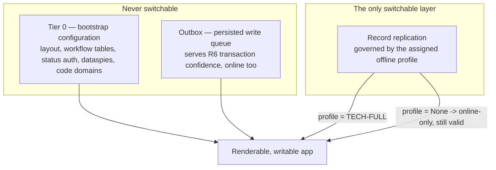
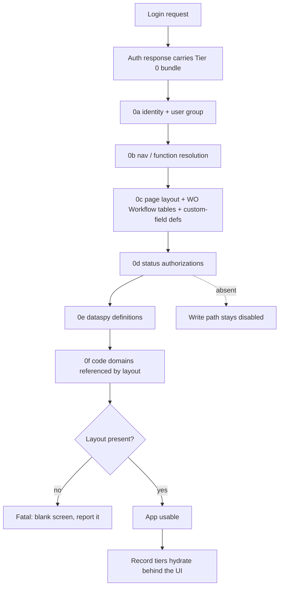
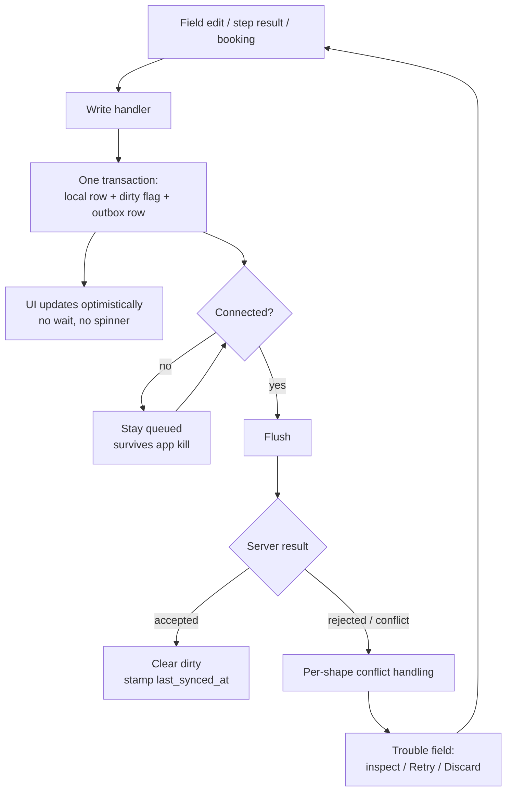
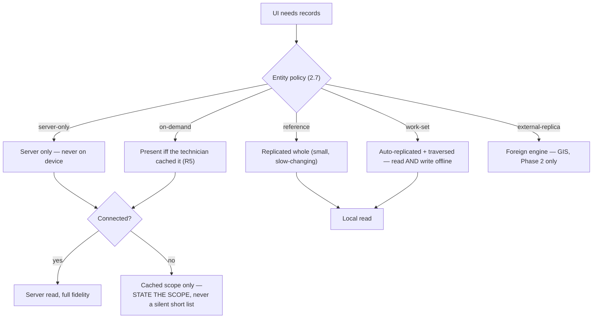

# Offline Architecture — Dev Lead Brief

*One app, one online/offline continuum. No mode, no mode chooser.*

**Scope:** just the offline/sync model, for a first read-in before M0 sign-off.
**Status:** locked 2026-09-08 (R1 online-first; R2/GIS deferred to Phase 2).
**This is a pointer layer, not a source of truth** — every rule below cites its
owning section in `design-decisions-v3-1.md` (`§`) or the design doc. If this
brief and the spec ever disagree, the spec wins; fix the brief.

---

## 1. The decision, in five lines

1. **Reads are online-first.** Connected, the server is the source of truth and
   answers at **full fidelity** — all fields, all joins, all predicates, exactly
   as desktop. The local store is a *scoped fallback*, never a projection of the
   database. *(§2.1)*
2. **Writes always go through a persisted outbox**, byte-identical online and
   offline. The outbox is never switchable — it answers *"did my transaction
   land?"* at full connectivity too. *(§2.4/§2.10)*
3. **Offline is declared per entity**, not per app. Five policies, customer
   configured, capped at authoring time. *(§2.7)*
4. **Database-wide search does not work offline.** There is no on-device index of
   records the technician doesn't hold. Offline search covers the work set plus
   what was manually cached — **and says so**. *(§2.1/§6.13, NG2)*
5. **The technician never chooses a connectivity mode.** Offline capability is
   *provisioned* per user group (an offline profile), not toggled. *(§2.10)*

**Why the polarity is this way round:** the predecessor fully-offline app
downloads so much that it crashes. Offline-first requires projecting the whole
database onto the device and forces an on-device search index; online-first makes
the search requirement an *improvement* rather than a compromise. Four options
were weighed once and the brief retired — **don't re-run that analysis** (§21).

---

## 2. Three layers, only one of them switchable

"Offline" is three capabilities, not one. *(§2.10)*

Consequences worth holding onto:

- **Records degrade, configuration does not.** Fewer rows is a shorter list; a
  missing layout is a blank screen. That is why Tier 0 is not one of the record
  tiers. *(§2.3)*
- **No `0d` (status authorizations) → no write path at all.** *(§2.3 consequence 3)*
- **Profile `None` is a valid configuration**, not a misconfiguration — and it is
  the one place the switch is visible to the technician, because the sync
  control's "Offline" state means the opposite thing for that user
  (*you cannot load work* vs *working from the device*). **Open design item.**
  *(§4.4.1/§2.10; design doc Open issue 7)*

---

## 3. Startup — Tier 0 first, because layout scopes everything after it

*(Diagram reused from the design doc, D1. Spec §2.3.)*

Fetch code domains *before* layout and you fetch the code universe blind; fetch
them *after* and you fetch a scoped subset. **Layout first is what keeps `0f`
small.** Tier 0 rides **inside the login round-trip — not a separate modal**;
"no blocking modals" prohibits bulk record download and connectivity-triggered
interruptions, not a user-initiated round-trip. *(§2.3)*

Record tiers then fill in behind the UI: work set (~20–200 WOs + children +
declared depth-1 references, ~5 s) → manually cached records → long-tail lookups
(~30 s) → historical documents (~90 s+). Practically offline-capable for their
own work inside ~30 seconds. *(§2.3)*

---

## 4. The write path — one path, no offline branch

*(Diagram reused from the design doc, D2. Spec §2.4/§2.5/§2.10.)*

**There is no offline branch in that diagram and that is the point** — one path
plus a sync engine. The UI never reads the network directly either: server
results are written to the local store first. *(§2.1/§6.13)*

**The write-enabled set is small and enumerable** — roughly seven EAM write
shapes: WO status/step state, checklist results, labor bookings, part issues,
meter readings, comments, attachments (plus GIS on its own channel in Phase 2).
Everything else the app can reach is read-only offline **by declaration, not
omission**. *(§2.4)*

**Conflicts are per write shape — last-write-wins is withdrawn**, because LWW is
silently lossy, and that is precisely the trust failure this app exists to fix.
Over seven shapes it is four rules: state machines **reject and surface**; field
edits **surface both values** and let the technician choose; comments/attachments
are append-only so cannot conflict; inserts are covered by the idempotency UUID.
**Invariant: no write is ever silently discarded.** *(§2.5)*

> Still genuinely open for M0: **conflict rules per write shape** at
> implementation grain. *(Design doc Timeline, M0.)*

---

## 5. Where a given row lives — the read path

| Policy | Read offline | Write offline | Examples |
| --- | --- | --- | --- |
| `server-only` | ✗ | ✗ | POs, WO/meter history, cost, reports, deep lookups, standalone UDS views |
| `reference` | ✓ | ✗ | code domains, employees, crews, trades, stores, page layout |
| `on-demand` (R5) | ✓ if cached | ✗ | any WO or asset the technician kept |
| `work-set` | ✓ | ✓ | pinned WOs + activities, checklist results, parts lines, labor lines |
| `external-replica` | ✓ | ✓ | GIS features / geodatabase — **Phase 2** |

*(§2.7 owns this table and the cap rationale.)*

**Policy says *whether* an entity can be offline; reachability traversal says
*which rows*.** A root pulls its children and its **declared depth-1
references**; references are terminal by default; closure is assembled
**server-side** — the client never walks the graph. *(§2.3)*

**Caps are enforced, not guidance**, adopted from market practice (D365,
Salesforce, ServiceMax, Maximo): device-wide record ceiling, per-entity row cap,
traversal depth/breadth cap, filters on indexed columns only, at least one filter
per entity ("all records" is refused), and an explicit list of entities that
**cannot** be offline — enforced at authoring time, not discovered on a device.
*(§2.7)*

**What reaches the device is two merged sources.** The punch list is *both* a
per-user-group **dataspy** (automatic) and **pinning** (manual, `R5PINS`). Two
implications for the data layer: the membership row must record **which source
pinned it**, or a dataspy re-evaluation evicts a manual pin; and a **local pin
must survive a server list that omits it**, or the next sync evicts live work.
*(§2.6/§14.11)*

---

## 6. The two places offline surfaces in the UI — and the one place it must not

**Lookups resolve three ways offline**, split by cardinality and dependency
rather than reachability *(§2.8)*:

| Class | Offline resolution |
| --- | --- |
| Bounded code domains (Department, Priority, UOM, Trade…) | `replicated` — ship the whole domain; it is kilobytes, and a missing 41st department reads as a **data error** |
| Unbounded entity lookups (Equipment, Parts, Stores/Bins/Lots) | `reachable` — derive options from what traversed onto the device. **The only place the million-row problem lives** |
| Definition-gated values (WO Type, Equipment system type, Class, Status) | selectable **only if the configuration they re-resolve is present** — bounded by Tier 0, not by what values exist |

> Row 2 carries an obligation: **announce the scope.** *"Showing the 12 assets on
> this work order — connect to search all."* A silent short list looks like
> correct data; it is the highest-risk failure mode of the whole approach. Same
> honesty invariant as §6.13's truncation rule.

> Keep **`definition-gated`** and **`not-hydrated`** distinct — the first should
> not render at all, the second renders and says it needs connectivity.
> Conflating them reports a configuration error as a sync problem. *(§2.8)*

**Actions may narrow; field state never does.** Per-action capability has five
states — `allowed` / `queued` / `substituted` / `blocked-visible` /
`blocked-hidden` — preferred in that order, because an absent control is
indistinguishable from a configuration error. The test is one question:

> **Can the server's answer be deferred without the technician acting on a wrong
> assumption?** Yes → queue it and keep the action set stable. No → visibly
> unavailable, **with a stated reason**. *(§2.9)*

Most work execution is `queued` (checklist results, status, Start Work on a
hydrated WO, labor, planned part lines, closing, comments, attachments). The
interesting exceptions: **Start Work on a non-hydrated WO** and an **ad-hoc part
not in the local stock snapshot** are `blocked-visible`; **server search** and an
**offline dataspy** are `substituted`, never disabled. Full enumeration at §2.9
(proposal, not locked).

**But `resolveFieldState()` never sees connectivity.** Required / Protected /
Optional / Hidden / Not Available resolve from page layout, which is Tier 0 and
therefore **identical online and offline**. Nothing becomes Protected because the
signal dropped — that would reintroduce the exact view/edit mode split §5.1
exists to reject. *(§2.9/§5.2)*

**Trap for the conditional-field-rules track (§13.1–§13.4):** a condition
evaluated server-side **silently does not apply offline** — the form accepts
values the server will later reject. One of the three one-way doors in §20.

---

## 7. Who owns which knob

| Thing | Owner | Where it lives |
| --- | --- | --- |
| Entity offline policy + caps (§2.7) | **Customer config** — scope | Sync Config, capped and validated |
| Lookup class per LOV (§2.8) | **Customer config**, inside the offline profile | Sync Config |
| Offline profile → user group (§2.10) | **Admin**, assignment only | User Group Setup › Offline tab (§29.6) |
| Per-action capability (§2.9) | **Product-declared, versioned with the app** | Code. **Deliberately not a Screen Designer control** |
| Conflict rule per write shape (§2.5) | **Product** | Sync engine |

Whether Start Work can complete without a server is not a customer preference —
which is why §2.9 is product-owned and §2.7 is not.

---

## 8. What is still open — and what is closed

| Open | Where |
| --- | --- |
| **Conflict rules per write shape**, at implementation grain — M0 gate | Design doc Timeline, M0 |
| **Sync control has no state/copy for an online-only user** — the only prototype change the R1 decision produced | §4.4.1/§2.10; Open issue 7 |
| **How often a technician searches off-work-set offline** — nobody has this number. Instrument it from M4 day one; re-adding an index stays additive | §20 |
| **`WSJOBS` reuse vs. a new mobile function** — blocks base-side layout authoring | §11/§20 |

**Closed — do not re-open:** the offline model itself (locked 2026-09-08), GIS
scope (R2 = Phase 2, §28), database-wide offline search (not supported, NG2), the
Tier 2 on-device index (retired with NG2), and offline-first read polarity.
Rejected alternatives and their reasoning are in §21 and the design doc's
Alternatives table.

---

### The SLOs this model is accountable to

*(Design doc owns these.)*

| | Target |
| --- | --- |
| Dataspy / search rendered, connected — now the **primary** read path | p95 ≤ 2 s |
| Record open, work-set, offline | p95 ≤ 400 ms |
| Cold start to Home, hydrated, offline | p95 ≤ 3 s |
| Local store on a full offline profile | ≤ 500 MB p99, hard enforced ceiling |

The last one is the number that says we fixed the predecessor.
